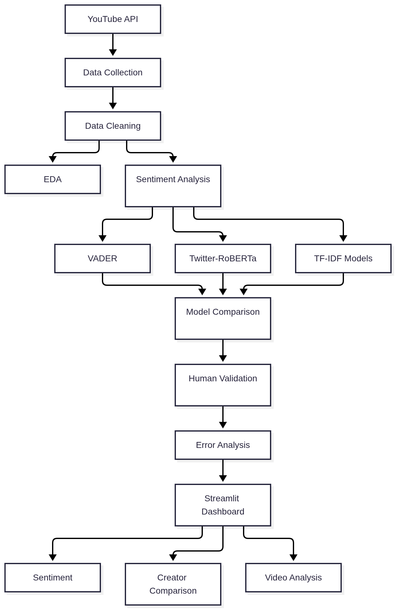

# YouTube Pulse: YouTube Content Sentiment Analysis

YouTube Pulse analyzes YouTube comments to understand **audience sentiment, engagement, vocabulary, and content patterns** across different creator communities.

The project combines a controlled research dataset with an interactive **Streamlit dashboard** for live YouTube URL analysis.

## Dataset

The research dataset contains **750 top-level comments from 15 videos** across three content domains:

| Domain | Creator | Videos | Comments |
|---|---|---:|---:|
| Technology | Mrwhosetheboss | 5 | 250 |
| Travel | Ryan Trahan | 5 | 250 |
| Cats | Abram Engle | 5 | 250 |
| **Total** | **3 creators** | **15** | **750** |

A separate **120-comment human-annotated validation set** was used to evaluate the sentiment models.


## Project Highlights

- Analyzed **750 YouTube comments** across 15 videos and 3 content domains.
- Compared **VADER and Twitter-RoBERTa** for sentiment classification.
- Used a **120-comment manually labeled dataset** for model validation.
- Performed exploratory analysis of **sentiment, engagement, comment length, and vocabulary**.
- Developed an interactive **Streamlit dashboard** for YouTube content analysis.

## Features

- YouTube video comment analysis
- Sentiment classification
- VADER and Twitter-RoBERTa comparison
- Creator and video comparison
- Comment engagement analysis
- Vocabulary analysis using TF-IDF
- Interactive visualizations using Plotly
- Streamlit-based dashboard


## System Architecture



## Sentiment Analysis

Two approaches were evaluated:

- **VADER**
- **Twitter-RoBERTa** (`cardiffnlp/twitter-roberta-base-sentiment-latest`)

A manually labeled sample of **120 comments** was used for validation.

| Model | Accuracy | Macro F1 |
|---|---:|---:|
| VADER | 60.83% | 55.38% |
| Transformer | 71.67% | 69.07% |

## Project Structure

```text
youtube-content-sentiment-analysis/
├── app.py
├── config/
├── data/
├── notebooks/
├── src/
├── streamlit/
├── .env.example
├── .gitignore
├── requirements.txt
└── README.md
```

## Technologies

Python · Pandas · NumPy · Scikit-learn · VADER · Hugging Face Transformers · Matplotlib · Plotly · Streamlit · YouTube Data API

## Run the Dashboard

```bash
pip install -r requirements.txt
streamlit run app.py
```
